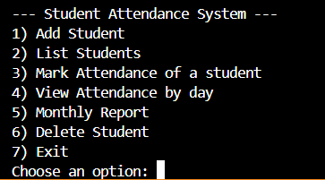

# Attendance Tracking System
## 📌 Overview
Attendance Tracking is a console-based system built with Go (Golang) to simplify and digitalize student attendance management. Instead of relying on manual registers or scattered spreadsheets, this provides a fast, reliable, and structured workflow to record, store, and analyze attendance data.
The system uses SQLite for persistent storage and follows a modular architecture that separates core functionalities like database operations, data models, and reporting. This makes the project lightweight, extensible, and easy to maintain.

## ✨ Key Features
- Student & Attendance Management: Add students, view students, delete student and organize their daily attendance.
- SQLite Integration: Reliable, persistent data storage.
- Report Generation: Produce summaries to analyze attendance and identify absences.
- Performance-Optimized: Written in Go for speed, concurrency, and efficiency.
- Modular Architecture: Database, models, and reporting layers are cleanly separated for easy maintenance and future expansion.

## ⚙️ Installation
Ensure you have Go (Golang) 1.20+ installed
Steps
1. Clone the Repository
```bash
git clone https://github.com/rahmaaref/attendance-tracking.git
```
2. Initialize Go Modules
```bash
go mod tidy
```
3. Build the Application
```bash
go build -o attendance
```
4. Run the Application
```bash
./attendance
```

## 🏗️ Tech Stack
- Programming Language: Go (Golang)
- Database: SQLite

## 📸 Screenshoot
Demo

  

## 🚀 Future Improvements
- Graphical User Interface (GUI): Develop a user-friendly desktop or web interface instead of console-based interaction.
